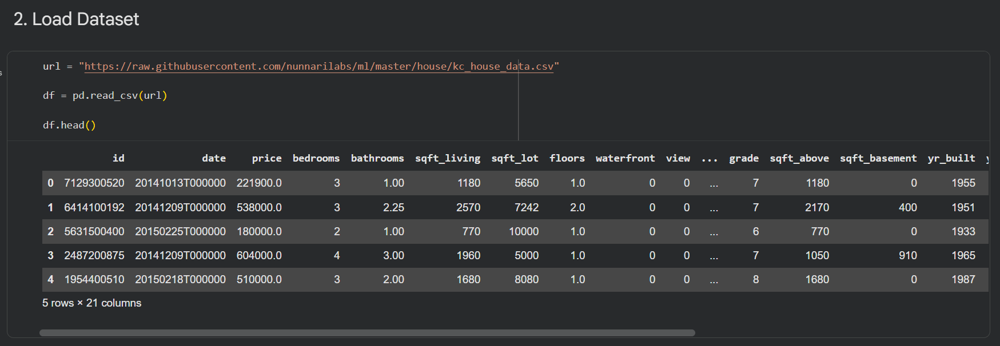
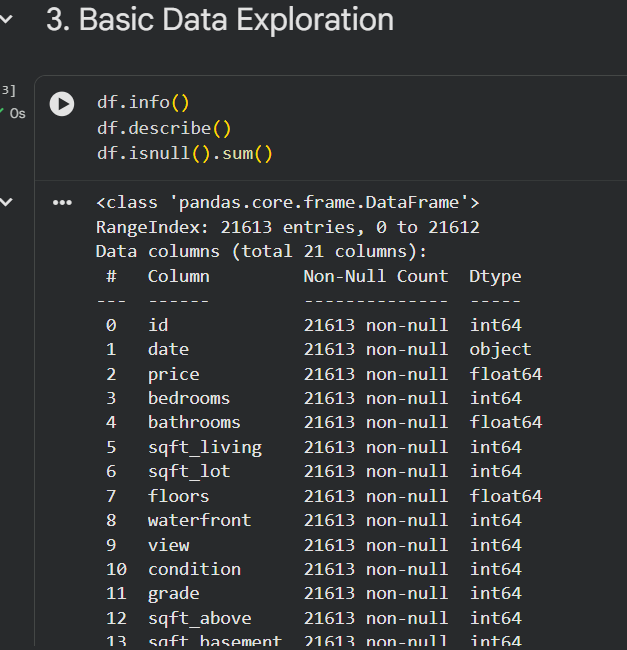
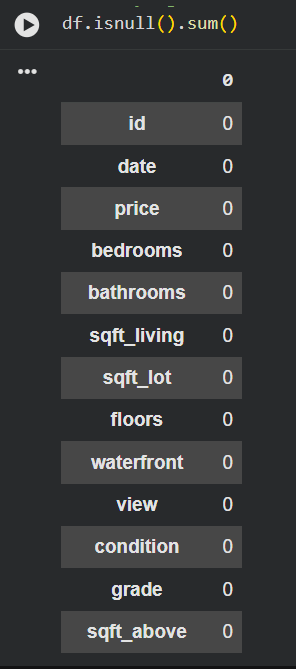
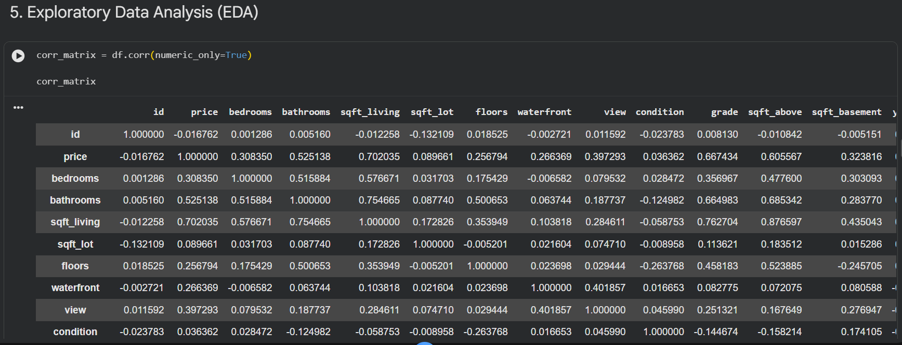
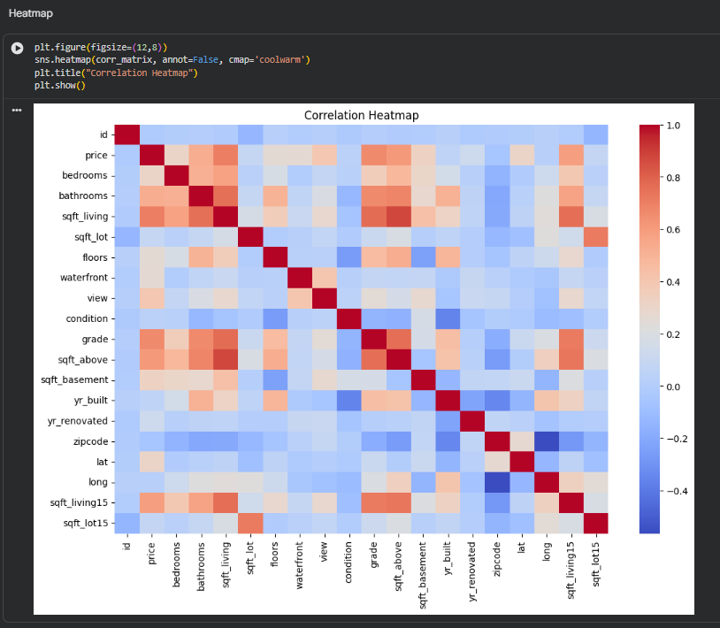
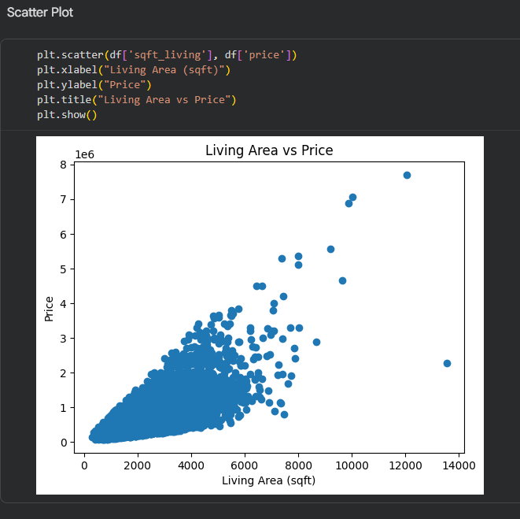
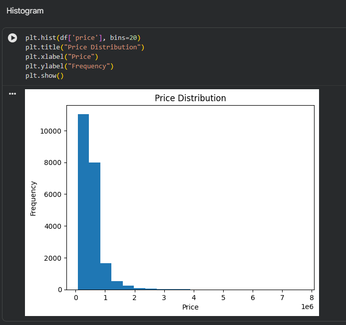

# 📅 Day 3 – House Price Prediction (EDA)

## 🎯 Objective

To apply Pandas, Data Cleaning, Exploratory Data Analysis (EDA), and Visualization techniques on a real-world dataset.

---

## 📘 Topics Covered

### 1. Pandas

* Loading dataset using `read_csv`
* Exploring data using `head()`, `info()`, `describe()`

### 2. Data Cleaning

* Identifying missing values using `isnull()`
* Handling missing data using `dropna()`
* Verifying cleaned dataset

### 3. Exploratory Data Analysis (EDA)

* Generating correlation matrix
* Understanding relationships between features

### 4. Data Visualization

* Heatmap for correlation visualization
* Scatter plots to identify relationships
* Histogram to understand distribution

---

## 💻 Implementation

The dataset was loaded using Pandas and explored to understand its structure.
Data cleaning was performed to ensure there were no missing values.
EDA techniques were applied to identify relationships between variables.
Visualization techniques helped in understanding patterns and trends in the data.

---

## 📸 Outputs

  

<b>Figure 1: Dataset preview using df.head()</b>

 

  

<b>Figure 2: Dataset structure using df.info()</b>

 

  

<b>Figure 3: Missing values after cleaning</b>

 

  

<b>Figure 4: Correlation matrix</b>

 

  

<b>Figure 5: Correlation heatmap</b>

 

  

<b>Figure 6: Living area vs price relationship</b>

 

  

<b>Figure 7: Price distribution</b>

---

## 🧠 Key Insights

* Price shows a strong positive relationship with living area (`sqft_living`)
* Houses with larger area tend to have higher prices
* Price distribution is right-skewed, indicating most houses fall in lower price ranges
* Some features have weaker correlations, showing less influence on price

---

## 🚀 Conclusion

Day 3 provided hands-on experience with real-world data analysis.
It helped in understanding how to clean, analyze, and visualize data effectively, which is a crucial step before building machine learning models.
