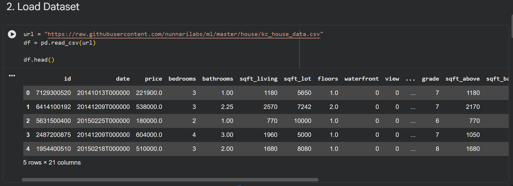
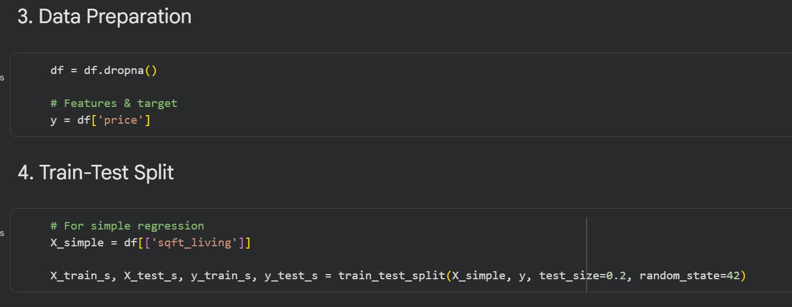
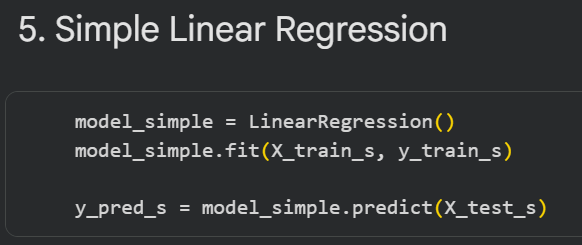
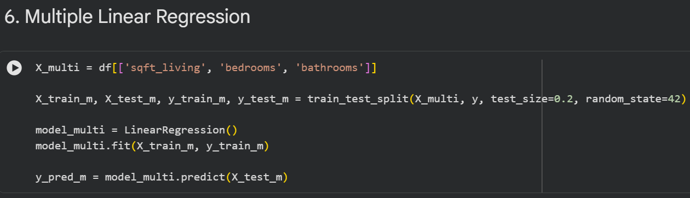
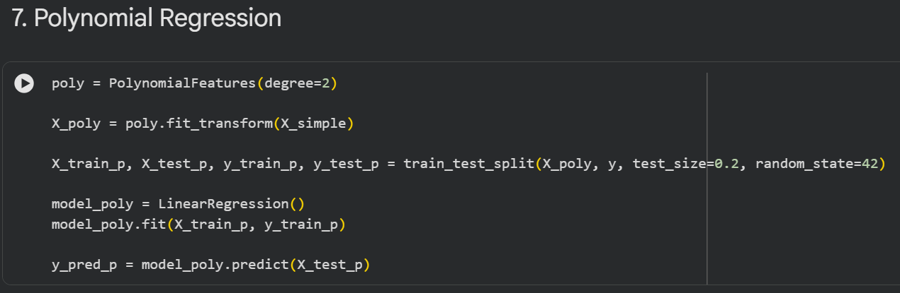
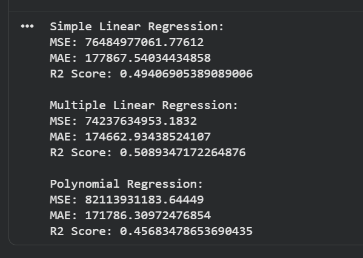

# 📅 Day 4 – Regression Models (Machine Learning)

## 🎯 Objective

To build and evaluate regression models using real-world data and understand how machine learning can be used for prediction.

---

## 📘 Topics Covered

### 1. Machine Learning Basics

* Types of Machine Learning: Supervised, Unsupervised, Reinforcement
* Supervised Learning: Regression and Classification

### 2. Regression Models

* Simple Linear Regression
* Multiple Linear Regression
* Polynomial Regression

### 3. Model Evaluation

* Mean Squared Error (MSE)
* Mean Absolute Error (MAE)
* R² Score

---

## 💻 Implementation

The house price dataset was used to build three regression models.
Each model was trained using training data and evaluated using test data.
Different models were compared to understand their performance.

---

## 📸 Outputs

  

<b>Figure 1: Dataset preview</b>

 

  

<b>Figure 2: Train-test split</b>

 

  

<b>Figure 3: Simple Linear Regression</b>

 

  

<b>Figure 4: Multiple Linear Regression</b>

 

  

<b>Figure 5: Polynomial Regression</b>

 

  

<b>Figure 6: Model evaluation and comparison</b>

---

## 🧠 Key Insights

* Multiple Linear Regression performed better than Simple Linear Regression
* Polynomial Regression captures non-linear relationships but did not outperform multiple regression in this case
* Using multiple relevant features improves prediction accuracy

---

## 🚀 Conclusion

Day 4 introduced machine learning concepts and model building.
It demonstrated how different regression models can be applied and compared to make predictions using real-world data.
