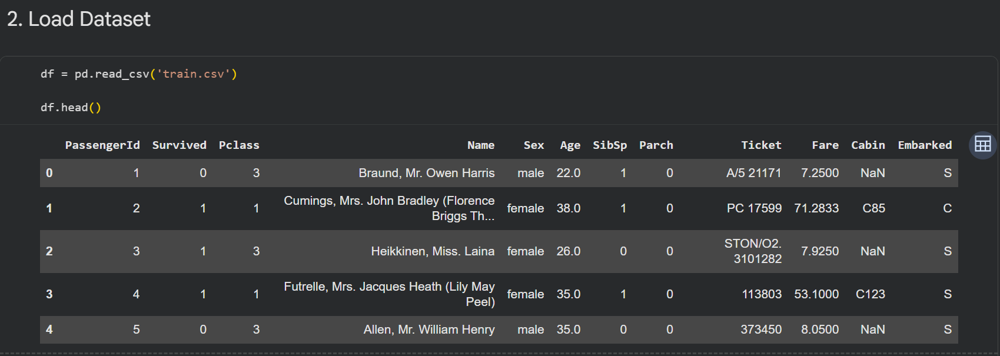
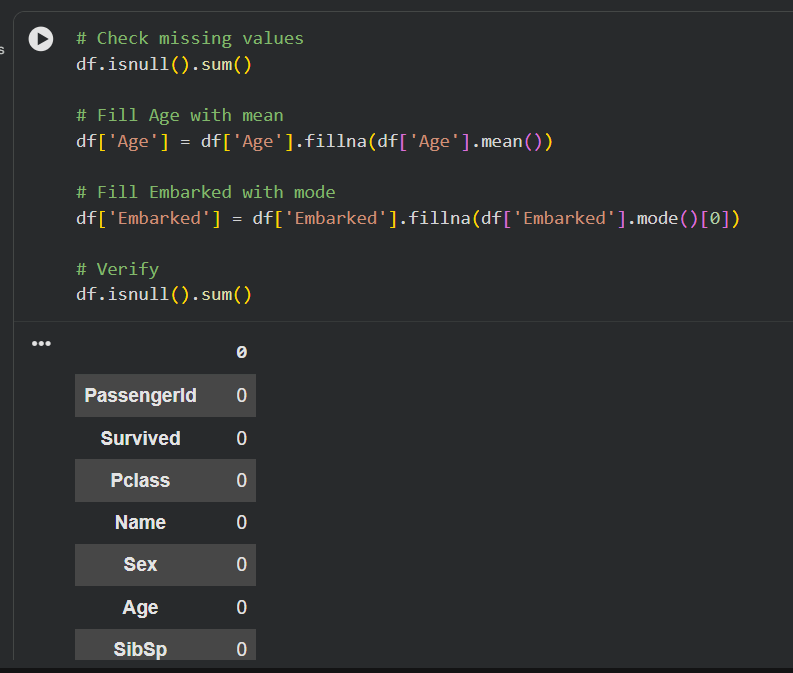
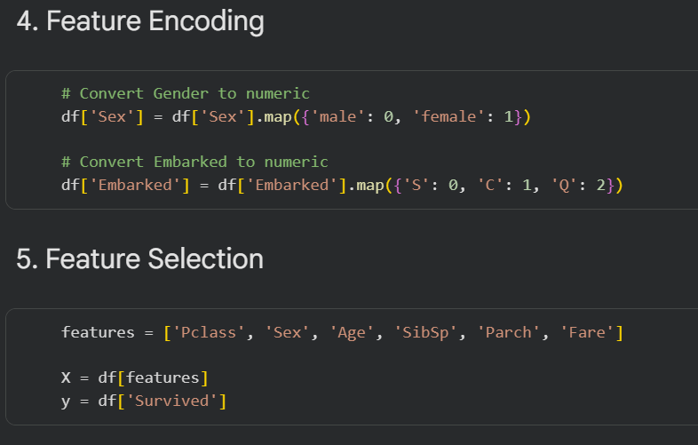
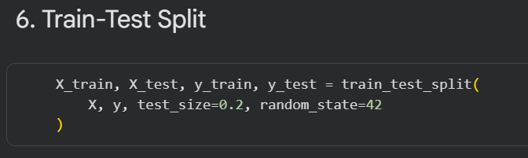
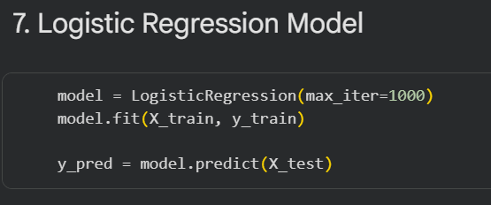
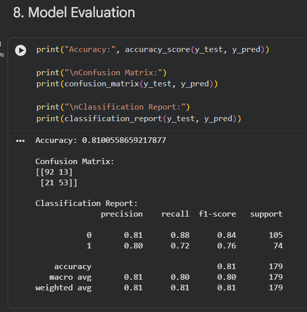

# 📅 Day 5 – Logistic Regression (Classification)

## 🎯 Objective

To build a classification model using Logistic Regression and predict survival outcomes using the Titanic dataset.

---

## 📘 Topics Covered

### 1. Machine Learning Basics

* Supervised Learning (Classification)
* Logistic Regression

### 2. Data Preprocessing

* Handling missing values (Age, Embarked)
* Encoding categorical variables (Sex, Embarked)

### 3. Model Building

* Train-test split
* Logistic Regression model training

### 4. Model Evaluation

* Accuracy Score
* Confusion Matrix
* Classification Report

---

## 💻 Implementation

The Titanic dataset was used to build a classification model to predict passenger survival.
Data preprocessing steps were applied, including handling missing values and encoding categorical features.
A Logistic Regression model was trained and evaluated using standard classification metrics.

---

## 📸 Outputs

  

<b>Figure 1: Dataset preview</b>

 

  

<b>Figure 2: Missing values handled</b>

 

  

<b>Figure 3: Feature encoding</b>

 

  

<b>Figure 4: Train-test split</b>

 

  

<b>Figure 5: Logistic Regression model</b>

 

  

<b>Figure 6: Model evaluation results</b>

---

## 🧠 Key Insights

* Logistic Regression effectively predicts survival outcomes
* Gender and passenger class strongly influence survival
* The model achieved ~81% accuracy, meeting the performance goal
* Some misclassifications exist, especially false negatives

---

## 🚀 Conclusion

Day 5 focused on classification and real-world prediction problems.
This project demonstrated how machine learning can be used to classify outcomes and evaluate model performance effectively.
