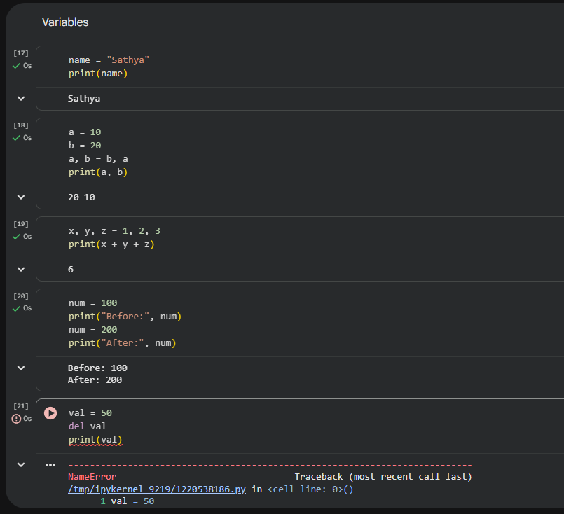
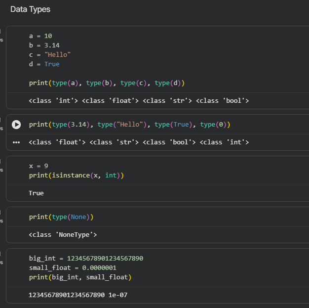
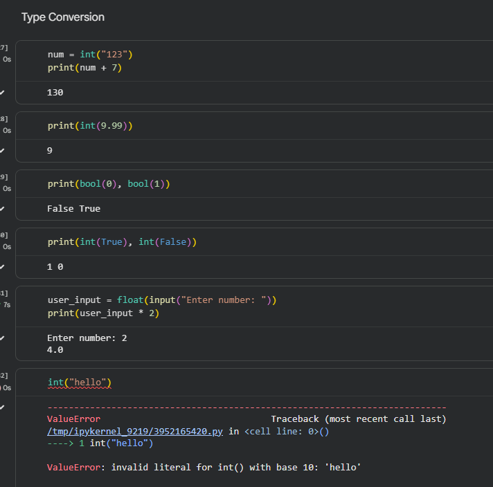
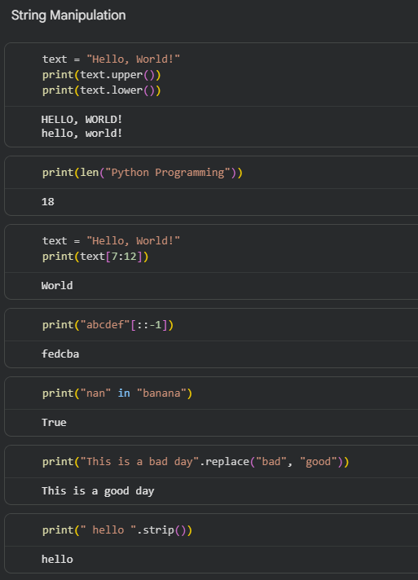
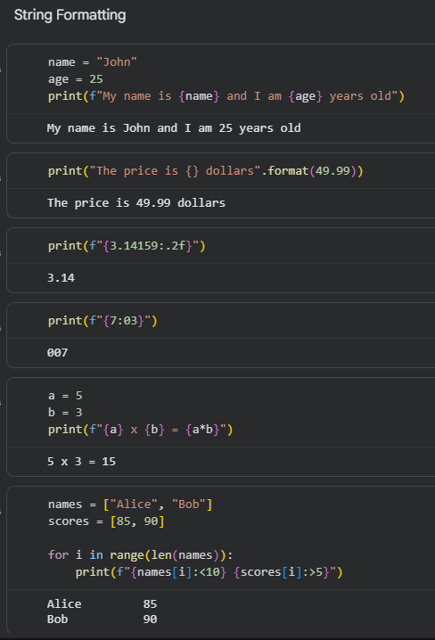
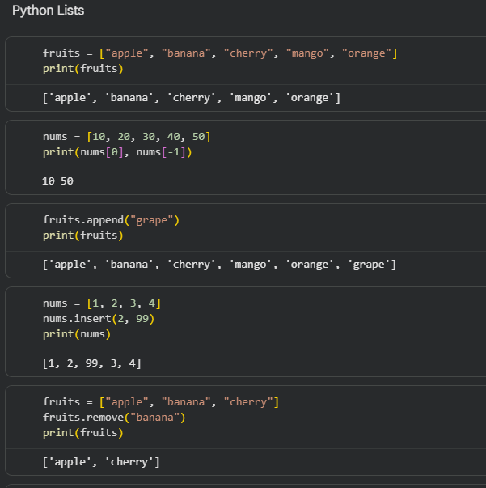

# Data Science Bootcamp – Nunnari Academy

## 📚 Table of Contents

| Day | Topic | Link |
|-----|------|------|
| Day 1 | Python Basics | [Open](Day1/) |
| Day 2 | Yet to be added | Coming Soon |
| Day 3 | Yet to be added | Coming Soon |
| Day 4 | Yet to be added | Coming Soon |
| Day 5 | Yet to be added | Coming Soon |

## 📅 Day 1

### 📘 Topic:

Introduction to Data Science & Python Basics

### 🧠 What I Learned:

* Basics of Data Science workflow
* Python fundamentals (variables, data types, lists, strings)
* Type conversion and formatting

### 💻 Task:

Solved Python beginner exercises covering all fundamental concepts.

### 📸 Outputs:

**Figure 1: Variables and basic operations**

**Figure 2: Data types and type checking**

**Figure 3: Type conversion and error handling**

**Figure 4: String manipulation operations**

**Figure 5: String formatting techniques**

**Figure 6: Python list operations**

